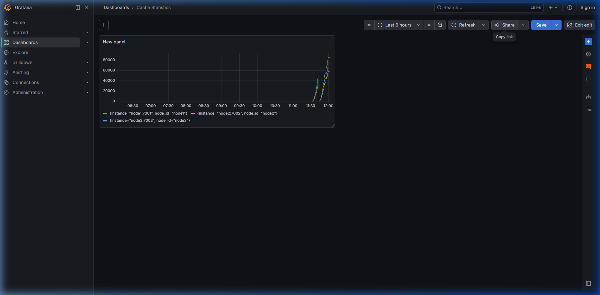

# cachedist

A distributed in-memory cache built from scratch in Go — inspired by Redis internals. Built as a portfolio project to demonstrate distributed systems concepts including consistent hashing, sharding, LRU eviction, gRPC replication, and fault tolerance.

> ⚠️ This is a learning/portfolio project, not production-ready software. The goal is to understand *how* systems like Redis work by building one.

***

## Architecture Overview

```
┌─────────────────────────────────────────────────────┐
│                   CLIENT APP                        │
└──────────────────┬──────────────────────────────────┘
                   │
                   ▼
┌─────────────────────────────────────────────────────┐
│              CACHE CLIENT SDK                       │
│         Consistent Hash Ring Routing                │
└──────┬──────────────┬──────────────┬────────────────┘
       │              │              │
       ▼              ▼              ▼
  ┌─────────┐   ┌─────────┐   ┌─────────┐
  │  NodeA  │   │  NodeB  │   │  NodeC  │
  │ :7001   │◄──►│ :7002   │◄──►│ :7003   │
  │         │   │         │   │         │
  │ 256     │   │ 256     │   │ 256     │
  │ shards  │   │ shards  │   │ shards  │
  └─────────┘   └─────────┘   └─────────┘
       ▲              ▲              ▲
       └──────────────┴──────────────┘
              gRPC inter-node (port 800x)
```

Each node stores data across 256 internal shards, each with its own `RWMutex` for maximum concurrent throughput.

***

## Features

- **Consistent Hashing** — keys are distributed across nodes using a hash ring with virtual nodes. Adding/removing nodes only moves a minimal subset of keys
- **Internal Sharding** — 256 shards per node with independent `RWMutex`, enabling parallel read/write without global locking
- **LRU Eviction** — O(1) eviction using a doubly linked list + hashmap. Least recently used items are evicted when capacity is reached
- **TTL Support** — per-key expiry with both lazy deletion (on GET) and active cleanup goroutine
- **gRPC Replication** — writes are synchronously replicated to replica nodes before ACK. Replication factor: 2
- **Write Quorum** — a write succeeds only when 2 out of N nodes confirm (configurable)
- **Health Check & Auto-Recovery** — nodes exchange heartbeats every 5 seconds. Dead nodes are removed from the ring and re-integrated after recovery
- **Prometheus Metrics** — hit rate, latency histograms, eviction count, and memory usage exposed at `/metrics`
- **Grafana Dashboard** — pre-configured visualization for real-time cluster monitoring


_Real-time monitoring showing cache hits across 3 nodes during the load test._

- **HTTP API** — simple JSON API for easy integration and manual testing with `curl`

***

## Quick Start

### Run 3-node cluster with Docker

```bash
git clone https://github.com/NichiNect/cachedist
cd cachedist

make docker-up
```

This starts 3 cache nodes on ports 7001, 7002, 7003.

### Manual test

```bash
# Set a key
curl -X POST http://localhost:7001/set \
  -H "Content-Type: application/json" \
  -d '{"key":"user:123","value":"john doe","ttl":60}'

# Get a key (SDK auto-routes to correct node)
curl http://localhost:7001/get?key=user:123

# Check node stats
curl http://localhost:7001/stats
```

### Run locally (3 nodes)

```bash
make run-node1   # Terminal 1
make run-node2   # Terminal 2
make run-node3   # Terminal 3
```

***

## API Reference

All responses use JSON:
```json
{ "success": true, "data": "...", "error": "" }
```

| Method | Endpoint | Description |
|--------|----------|-------------|
| `GET` | `/get?key={key}` | Retrieve a value by key |
| `POST` | `/set` | Store a value (`key`, `value`, `ttl` in seconds) |
| `DELETE` | `/delete?key={key}` | Remove a key |
| `GET` | `/stats` | Node statistics: hit rate, item count, uptime |
| `GET` | `/health` | Health check endpoint |
| `GET` | `/keys` | List all keys (debug only) |

***

## Configuration

| Environment Variable | Default | Description |
|----------------------|---------|-------------|
| `CACHE_NODE_ID` | `node-1` | Unique node identifier |
| `CACHE_HTTP_PORT` | `7001` | HTTP server port |
| `CACHE_GRPC_PORT` | `8001` | gRPC inter-node port |
| `CACHE_NUM_SHARDS` | `256` | Number of internal shards |
| `CACHE_MAX_ITEMS` | `1000000` | Max items per node before eviction |
| `CACHE_TTL_CLEANUP` | `30` | TTL cleanup interval (seconds) |
| `CACHE_PEERS` | `` | Comma-separated peer addresses (`host:grpcport`) |
| `CACHE_REPLICATION_FACTOR` | `2` | Number of replicas per key |
| `CACHE_VIRTUAL_NODES` | `150` | Virtual nodes per physical node in hash ring |

***

## Build Steps

This project was built incrementally in 7 steps. Each step is a fully runnable milestone.

| Step | Branch | Focus | Testable Outcome |
|------|--------|-------|-----------------|
| 1 | `step/1-single-node` | Single-node cache + HTTP API | `curl /set` and `/get` work |
| 2 | `step/2-sharding-lru-ttl` | Sharding + LRU eviction + TTL | Benchmark shows parallel shard speedup |
| 3 | `step/3-multi-node` | Multi-node + consistent hash SDK | SDK auto-routes keys to correct node |
| 4 | `step/4-replication` | gRPC write replication + quorum | Key survives primary node crash |
| 5 | `step/5-health-check` | Heartbeat + auto node recovery | Node rejoin without data corruption |
| 6 | `step/6-metrics` | Prometheus metrics endpoint | Grafana dashboard shows live hit rate |
| 7 | `step/7-benchmark` | Benchmark vs Redis | Throughput comparison report |

***

## Benchmarks

Benchmarks were performed on an **AMD Ryzen 7 5825U** (8 cores, 16 threads) with 16GB RAM.

### Go Internal Benchmarks
These measure the raw performance of the sharded cache engine (single-node, no network).

| Benchmark | Operations | Latency | Memory/Op |
|-----------|------------|---------|-----------|
| `Get` (Single) | ~12.1M ops/s | 95.8 ns/op | 16 B/op |
| `Set` (Single) | ~1.0M ops/s | 1200 ns/op | 337 B/op |
| `Get` (Parallel) | ~7.3M ops/s | 165.6 ns/op | 16 B/op |
| `Set` (Parallel) | ~8.4M ops/s | 153.7 ns/op | 111 B/op |
| `Mixed (80/20)` | ~12.0M ops/s | 100.5 ns/op | 34 B/op |

### Comparison: cachedist vs Redis
This compares a single-node `cachedist` (in-process) against a standard Redis container accessed via `go-redis` client.

| Operation | cachedist (Internal) | Redis (via Network) |
|-----------|----------------------|---------------------|
| **SET** | ~1.2M ops/sec | ~3.5k ops/sec |
| **GET** | ~12.5M ops/sec | ~3.6k ops/sec |

> **Note on Latency**: The massive difference is due to `cachedist` being tested as an in-process library, whereas Redis involves network syscalls, serialization, and container overhead. In a real-world networked scenario (see Load Test), the gap narrows.

### Distributed Load Test
Tested on a **3-node cluster** (Docker) with a replication factor of 2, using the SDK with 10 concurrent goroutines.

- **Total Operations**: 100,000
- **Workload**: 70% GET, 20% SET, 10% DELETE
- **Throughput**: **1,163.47 ops/sec**
- **Error Rate**: **0.00%**
- **Average Latency**: ~8.6ms per request (including inter-node replication)

### Chaos Test (Node Failure Resilience)
Simulated a sudden node failure during active background load (5 concurrent workers).

- **Total Operations**: 4,756
- **Action**: `docker stop node2` while traffic was running.
- **Error Rate while Node Down**: **0.00%** (SDK automatically failed over to replicas).
- **Recovery**: Node rejoined and synchronized data without manual intervention.

***

## What I Learned

Building this project taught me several critical lessons about distributed systems and Go:

1. **Lock Contention is a Silent Killer**: In early versions, a single global mutex crippled performance. Implementing 256 shards drastically improved parallel throughput by allowing goroutines to work on different parts of the keyspace simultaneously.
2. **Consistent Hashing is Elegant**: It's the "magic" that makes horizontal scaling possible without reshuffling the entire database. Implementing virtual nodes showed me how to achieve a uniform data distribution across nodes.
3. **Replication Trade-offs**: Implementing synchronous replication (quorum) showed the clear trade-off between consistency and latency. Every write becomes slower because it has to wait for a network ACK from a peer.
4. **Observability is Non-Negotiable**: Without Prometheus and Grafana, debugging why a node was "stuck" or measuring the impact of a change was guesswork. Metrics turned black-box behavior into actionable data.
5. **Docker Networking Gotchas**: I learned the hard way that `127.0.0.1` inside a container isn't the same as the host's `localhost`, which forced me to implement a more robust node discovery and advertisement mechanism.

***

## Key Concepts Demonstrated

### Consistent Hashing
Keys are mapped to nodes using a hash ring. Adding a new node only moves keys in the range between the new node and its predecessor — the rest stay put.

### LRU Eviction (O(1))
```
HEAD [most recent] ←→ ... ←→ [least recent] TAIL
                                      ↑ evicted first
```
Implemented as a doubly linked list + hashmap. Every `GET` moves the item to the HEAD. When capacity is full, TAIL is removed.

### Write Quorum
A write to key `user:123` succeeds when at least `ceil(replication_factor / 2) + 1` nodes confirm. With replication factor 2, both primary and replica must ACK.

### Sharding for Parallelism
```go
func (c *Cache) getShard(key string) *Shard {
    h := fnv32(key)
    return c.shards[h % uint32(c.numShards)]
}
// 256 independent RWMutex — reads on different shards run fully parallel
```

***

## Project Structure

```
cachedist/
├── cmd/
│   ├── server/         # Cache server entry point
│   └── cli/            # CLI for manual interaction
├── internal/
│   ├── cache/          # Core engine: shards, LRU, TTL
│   ├── server/         # HTTP handlers
│   ├── cluster/        # Hash ring, node management
│   ├── replication/    # gRPC write replication
│   ├── grpc/           # gRPC server & client
│   └── metrics/        # Prometheus integration
├── proto/              # Protobuf definitions
├── sdk/                # Client SDK with consistent hashing
├── config/             # Config loader
├── docker/             # Dockerfile + docker-compose
├── Makefile
├── SKILLS.md           # Architecture decisions & AI coding contract
└── README.md
```

***

## Tech Stack

| Component | Technology |
|-----------|------------|
| Language | Go 1.22+ |
| Inter-node RPC | gRPC + Protobuf |
| Client API | HTTP/JSON |
| Metrics | Prometheus |
| Containerization | Docker + docker-compose |
| Hashing | FNV-1a (stdlib) + consistent hashing (custom) |

***

## License

MIT